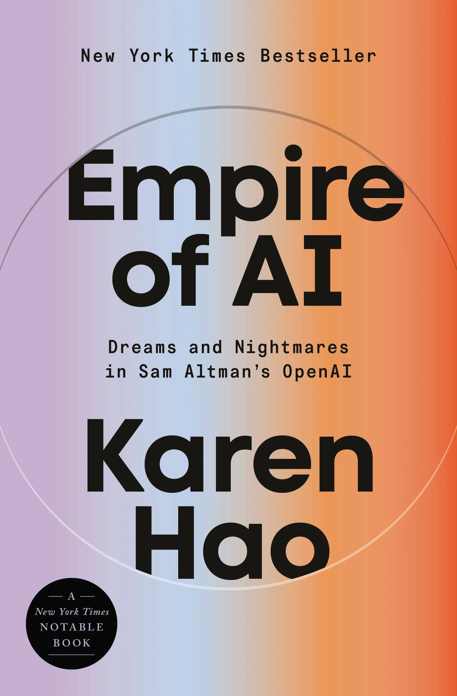
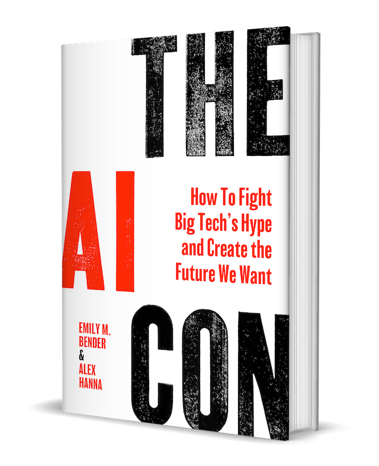
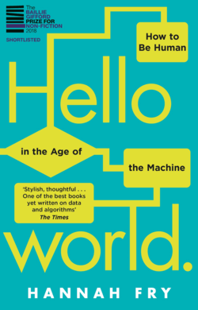

# Algorithms & Artificial Intelligence

## On Artificial Intelligence

  - Read: [The Illusion of AI](https://tacticaltech.org/news/insights/illusion-ai/)

  - Watch: [Being in the World](https://www.youtube.com/watch?v=fcCRmf_tHW8) _(award winning documentary by Tao Ruspoli)_
    - [IMDB](https://www.imdb.com/title/tt1515195/)
  - Watch: [The Labor that Makes AI "Magic" | Lilly Irani | AI Now 2016](https://www.youtube.com/watch?v=5vXqpc2jCKs)

  **Resources:**

  - [Human in the Loop: Exploring the Unintended Consequences of Generative AI in India](https://loop.digitalfutureslab.in/)
  - [The Distributed AI Research Institute (DAIR)](https://www.dair-institute.org/)
  - [AI Models by Epoch AI](https://epoch.ai/data/ai-models) _(A comprehensive database of over 3200 AI models)_

  **Initiatives:**

  - [QuitGPT](https://quitgpt.org/)

## On Racism, Bias & Discrimination

  - Watch: [Algorithms of Suspicion by Lilly Irani - Centre for Digital Culture](https://www.youtube.com/watch?v=iAK5nhCF-nk)
  - Watch: [AI and Gender (UNESCO)](https://www.youtube.com/watch?v=V-nIJhWcL0Y)

## TERMINOLOGY

  - **Gait Recognition:** _"A gait recognition (software) system uses the shape of the human body and the way it moves in order to identify it."_ [(Source)](https://recfaces.com/articles/what-is-gait-recognition)

## BIBLIOGRAPHY

  - [Empire of AI](https://karendhao.com/)

    

  - [The AI Con: How to Fight Big Tech’s Hype and Create the Future We Want](https://thecon.ai/)

    

  - [Hello World: How to Be Human in the Age of the Machine](https://en.wikipedia.org/wiki/Hello_World%3A_How_to_be_Human_in_the_Age_of_the_Machine)

    
