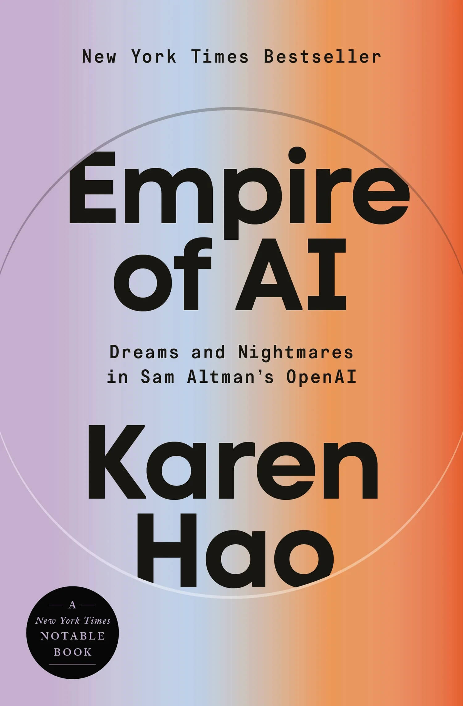
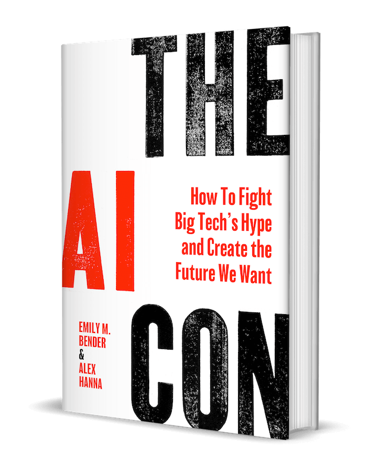
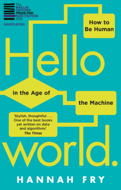

# Algorithms & Artificial Intelligence

## On Artificial Intelligence

  - Read: [The Illusion of AI](https://tacticaltech.org/news/insights/illusion-ai/)
  - Read: [Man files complaint after ChatGPT said he killed his children](https://www.bbc.com/news/articles/c0kgydkr516o)

  - Watch: [Being in the World](https://www.youtube.com/watch?v=fcCRmf_tHW8) _(award winning documentary by Tao Ruspoli)_
    - [IMDB](https://www.imdb.com/title/tt1515195/)
  - Watch: [The Labor that Makes AI "Magic" | Lilly Irani | AI Now 2016](https://www.youtube.com/watch?v=5vXqpc2jCKs)
  - Watch: [Virtual love - How dangerous are AI relationships? | DW Documentary](https://www.youtube.com/watch?v=xAHLK1B5ijs)
  - Watch: [Madagascar: AI Trainers (Documentary)](https://www.youtube.com/watch?v=Q7NZK6h9Tvo)
  - Watch: [I Tracked Down the Hidden Workers Secretly Powering ChatGPT](https://www.youtube.com/watch?v=aooiDA-AsNo)
  - Watch: [We're building a dystopia just to make people click on ads](https://www.ted.com/talks/zeynep_tufekci_we_re_building_a_dystopia_just_to_make_people_click_on_ads)

  - Listen: [Feminism vs the algorithm: Laura Bates sounds the alarm](https://www.youtube.com/watch?v=TZThXeXiV2Y)

  **Resources:**

  - [AI Incident Database](https://incidentdatabase.ai/)
    - "The AI Incident Database is dedicated to indexing the collective history of harms or near harms realized in the real world by the deployment of artificial intelligence systems."
  - [AI Models by Epoch AI](https://epoch.ai/data/ai-models) _(A comprehensive database of over 3200 AI models)_
  - [Human in the Loop: Exploring the Unintended Consequences of Generative AI in India](https://loop.digitalfutureslab.in/)
  - [Suspicion Machines](https://www.lighthousereports.com/series/suspicion-machines/)
  - [The Distributed AI Research Institute (DAIR)](https://www.dair-institute.org/)
  - [How To Turn OFF AI Overview In Google Search](https://www.youtube.com/watch?v=qJmvO64Xxe8)

  **Initiatives:**

  - [**AI Accountability Network**: The Artificial Intelligence Accountability Network supports and brings together journalists reporting on AI and with AI globally.](https://pulitzercenter.org/journalism/initiatives/ai-accountability-network)
  - [**QuitGPT**](https://quitgpt.org/)

  **Groups:**

  - [AI Now Institute](https://ainowinstitute.org)
  - [AlgorithmWatch](https://algorithmwatch.org/en/): _"We fight for a world where algorithms and Artificial Intelligence (AI) do not weaken justice, human rights, democracy, and sustainability but strengthen them."_
  - [Data Labelers Association: Championing Fair Treatment and Empowerment for Data Labelers in the AI Industry](https://www.linkedin.com/company/data-labelers-association/)

## On Racism, Bias & Discrimination

  - Watch: [Algorithms of Suspicion by Lilly Irani - Centre for Digital Culture](https://www.youtube.com/watch?v=iAK5nhCF-nk)
  - Watch: [AI and Gender (UNESCO)](https://www.youtube.com/watch?v=V-nIJhWcL0Y)

## On Health Care

  - Read: [High Hopes for “Deep Medicine”? AI, Economics, and the Future of Care](https://onlinelibrary.wiley.com/doi/10.1002/hast.1079)

## TERMINOLOGY

  - **Gait Recognition:** _"A gait recognition (software) system uses the shape of the human body and the way it moves in order to identify it."_ [(Source)](https://recfaces.com/articles/what-is-gait-recognition)
  - **Mathwashing:** _"The widespread misconception that because math is involved, algorithms are automatically neutral and companies and organizations are able to avoid responsibility by hiding behind algorithms."_
    - [mathwashing.com](https://www.mathwashing.com/)

## BIBLIOGRAPHY

  - [Empire of AI](https://karendhao.com/)

    

  - [The AI Con: How to Fight Big Tech’s Hype and Create the Future We Want](https://thecon.ai/)

    

  - [Hello World: How to Be Human in the Age of the Machine](https://en.wikipedia.org/wiki/Hello_World%3A_How_to_be_Human_in_the_Age_of_the_Machine)

    
