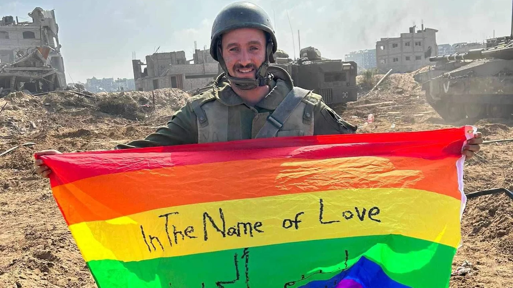
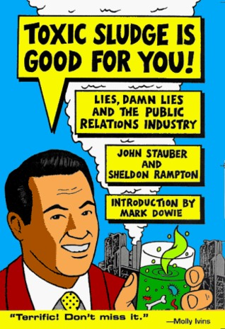
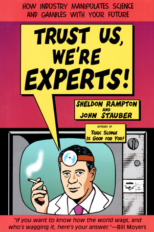

# Public Relations (PR)

> _"Public relations (PR) is the practice of managing and disseminating information from an individual or an organization (such as a business, government agency, or a nonprofit organization) to the public in order to influence their perception."_ [Source: Wikipedia](https://en.wikipedia.org/wiki/Public_relations) | [Revision link](https://en.wikipedia.org/w/index.php?title=Public_relations&oldid=1321995911)

## TERMINOLOGY

### TERMINOLOGY | WHITEWASHING

  _"Whitewashing is the act of minimizing or covering up vices, crimes or scandals, or of exonerating the guilty by means of a perfunctory investigation or biased presentation of data with the intention to improve someone's reputation."_ [Source: Wikipedia](https://en.wikipedia.org/wiki/Whitewashing_(communications)) | [Revision link](https://en.wikipedia.org/w/index.php?title=Whitewashing_(communications)&oldid=1314483115)

### TERMINOLOGY | GREENWASHING

  _"Greenwashing (a compound word modeled on "Whitewashing"), also called green sheen, is a form of advertising or marketing spin that deceptively uses green PR and green marketing to persuade the public that an organization's products, goals, or policies are environmentally friendly."_ [Source: Wikipedia](https://en.wikipedia.org/wiki/Greenwashing) | [Revision link](https://en.wikipedia.org/w/index.php?title=Greenwashing&oldid=1328862265)

  

  _(A Volkswagen Golf TDI in 2010, featuring the phrase "clean diesel". The company later faced scrutiny and conviction due to an emissions scandal. [Source: Wikipedia](https://en.wikipedia.org/w/index.php?title=Greenwashing&oldid=1328862265#/media/File:VW_Golf_TDI_Clean_Diesel_WAS_2010_8983.JPG))_

### TERMINOLOGY | PINKWASHING

  _"Pinkwashing, also known as rainbow-washing, is the strategy of deploying messages that are superficially sympathetic towards the LGBTQ community for ends having little or nothing to do with LGBTQ equality or inclusion, including LGBTQ marketing."_ [Source: Wikipedia](https://en.wikipedia.org/wiki/Pinkwashing_(LGBTQ)) | [Revision link](https://en.wikipedia.org/w/index.php?title=Pinkwashing_(LGBTQ)&oldid=1323452150)
  
  _"The term 'pinkwashing' is (also) associated with companies that use the pink ribbon symbol or use the support of breast cancer charities as a marketing technique, to promote one of their products, while at the same time manufactured products have proven to contain ingredients that are linked to the disease developed or are used in a manner that associates it with the increased risk of disease."_ [Source: Wikipedia](https://en.wikipedia.org/wiki/Pinkwashing_(breast_cancer)) | [Revision link](https://en.wikipedia.org/w/index.php?title=Pinkwashing_(breast_cancer)&oldid=1328721645)

  

  _(Yoav Atzmoni, a gay 31-year-old soldier, displaying an LGBTQ+ banner and an Israeli flag with rainbow colours while participating in the invasion of Gaza. [Source: Middle East Eye](https://www.middleeasteye.net/sites/default/files/styles/article_page/public/images-story/F-wyJgcWEAAwito.jpg.webp?itok=6RmIIjfA))_

## BIBLIOGRAPHY

  - [Toxic Sludge Is Good For You: Lies, Damn Lies and the Public Relations Industry, by John Stauber and Sheldon Rampton](https://www.prwatch.org/books/tsigfy.html)

  

  - [Trust Us, We're Experts: Trust Us, We're Experts!: How Industry Manipulates Science and Gambles with Your FutureHow Industry Manipulates Science and Gambles with Your Future](https://www.prwatch.org/books/experts.html)

  